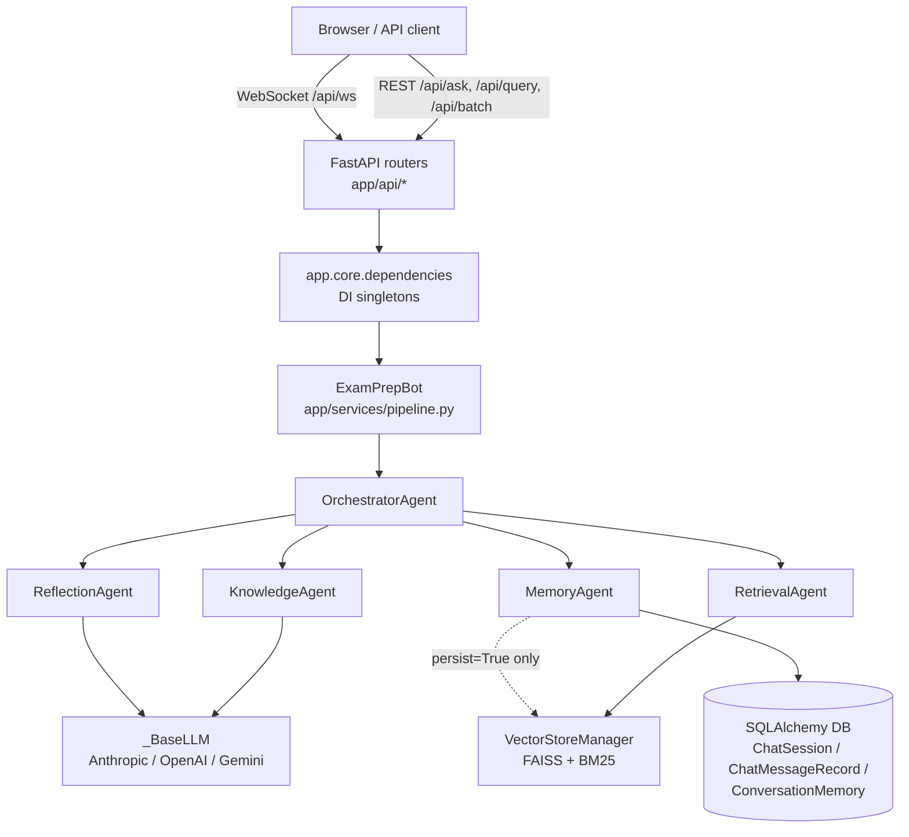
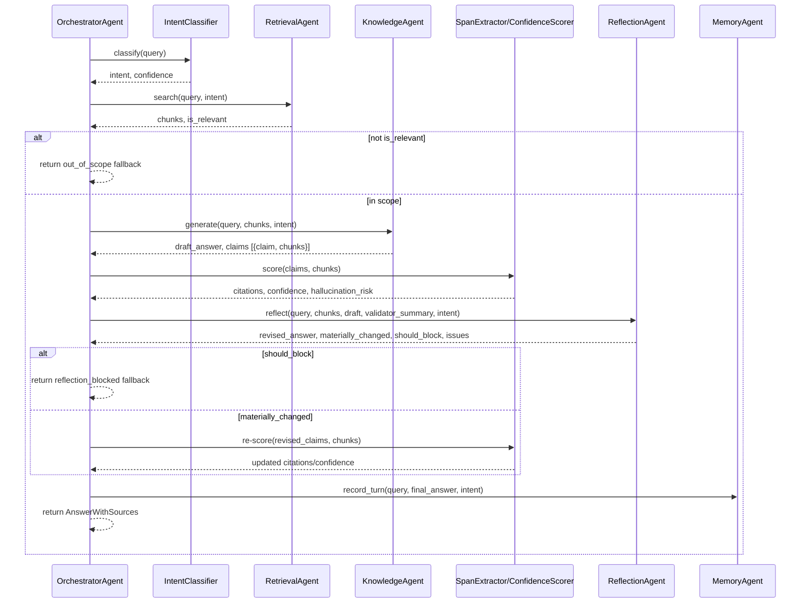
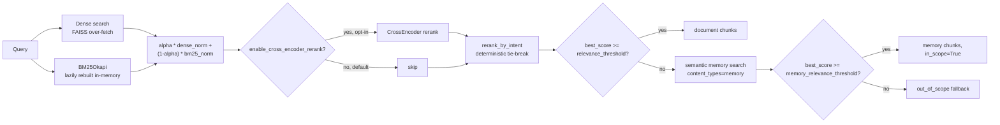
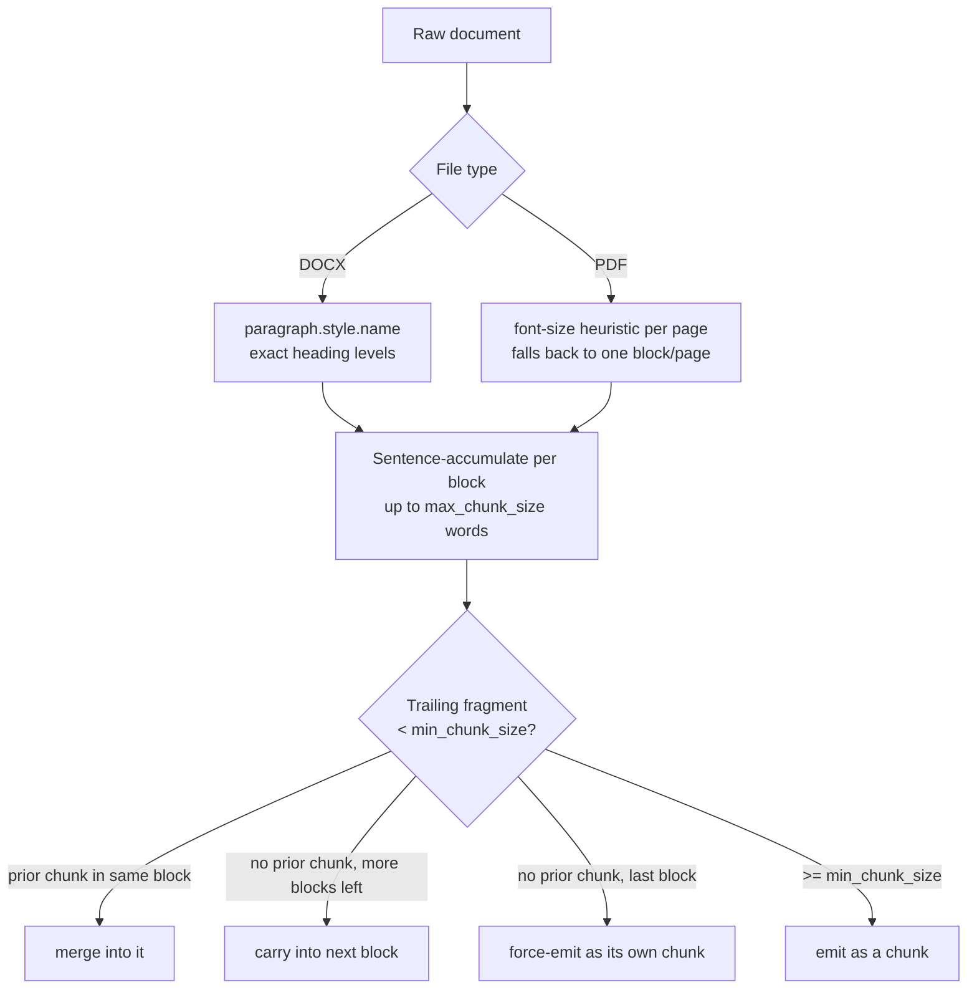
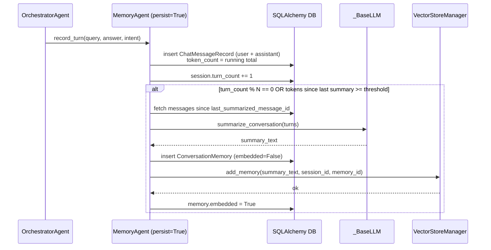

# Architecture Overview

This document covers the multi-agent RAG pipeline, memory architecture, and retrieval flow added in
the Phase 1 rebuild. For setup/commands and file-level pointers, see `CLAUDE.md`. For what's
deliberately deferred, see `PHASE_2_ROADMAP.md`.

## System overview

## Agent workflow (per query)

`OrchestratorAgent.run()` is deterministic Python, not an LLM router — with only one downstream
answer-producing agent this phase (Knowledge), there's nothing meaningful to route between yet.
`IntentClassifier` already parameterizes the pipeline (top_k, prompt template, format_type); that's a
different thing from agent selection. Real LLM-based routing becomes justified once Phase 2 agents
(Quiz/StudyPlanner/...) exist to route between — see the roadmap doc.

Stage names fired via the optional `on_stage(stage, payload)` callback (used by the WebSocket route):
`retrieving` → `drafting` → `draft_ready` → `reflecting` → `final_ready`.

## WebSocket streaming contract (`/api/ws`)

Additive only — the REST `/api/ask` response shape (`AnswerWithSources`/`QueryResponse`) is untouched.

| Message | When | Shape |
|---|---|---|
| `intent` | After intent classification | `{"type": "intent", "intent": str, "confidence": float}` |
| `chunk` | Draft and final answer text, chunked | `{"type": "chunk", "text": str, "stage": "draft" \| "final"}` |
| `status` | Once, before the reflection LLM call | `{"type": "status", "stage": "reflecting", "message": str}` |
| `complete` | End of turn | unchanged: `answer`, `query_intent`, `format_type`, `sources`, `confidence`, `hallucination_risk`, `response_time` |
| `error` | Any failure | `{"type": "error", "message": str}` |

This is an honest two-stage progressive reveal (draft, then possibly-revised final) — not true
token-level LLM streaming, which is out of scope this phase.

## Retrieval pipeline

Both FAISS and BM25 operate over the *same* shared index, discriminated by a `content_type` field
(`"document"` or `"memory"`) on each chunk's metadata — not two separate indices, to avoid duplicating
the persistence/locking/consistency-check machinery this project already hardened around FAISS.

## Chunking (parser.py)

A non-empty document never yields zero chunks — every trailing fragment lands somewhere.

## Conversation memory tiers

| Tier | Backing store | Access pattern | When invoked |
|---|---|---|---|
| Short-term | In-memory `chat_history` list | Verbatim recency window | Every turn (always active) |
| Episodic | `ChatMessageRecord` rows for one `session_id` | Direct lookup, chronological | Only on explicit reference (not yet wired to an endpoint) |
| Long-term/semantic | `ConversationMemory` rows, embedded (`content_type="memory"`) | `VectorStoreManager.search(content_types=["memory"])` | Only when document retrieval misses |

`persist=True` is forward-compat plumbing, not the default — there is no per-user session concept
wired into `ExamPrepBot`/`get_bot()` yet (today's auth is a single shared `APP_API_KEY`). A memory row
is written *before* the embedding call, so a crash between the two never loses the summary — an
unembedded row (`embedded=False`) is simply invisible to semantic search and can be retried.
